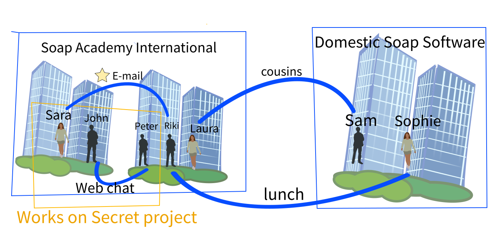

# Ontology project for Knoledge Base class ,Master's degree(AI), University of Sofia

Author: Borislav Markov

# Introduction

This ontology will describe a criminal story similar to
"soap opera" series. This is same story as initial version of the project
https://github.com/borkox/uni-sofia-ontology-project but with GraphDB
and no custom rules used, just SPARQL and OWL reasoning supported by
the engine of GraphDB.

# The soap criminal story 2
John works for a software company "Soap Academy International".
The project that John works for has confidential information
and is called "Robo Soap Strategy". John has a colleague Peter,
who knows John very well, and they are friends. They work on the
same confidential project. They always chat on company's messenger.
John and Peter have colleague Riki, who knows Peter, but doesn't
know John in person. John have colleague Sara, who works on the same
confidential project. Riki doesn't work for project "Robo Soap Strategy".
Laura also works for company "Soap Academy International" and is in love
with John, but she is in another building. John doesn't share her feelings.
John and Laura doesn't meet very often, only on company events. Riki
loves Laura, but she doesn't pay attention to him.  Riki can do anything
to attract her. An email has been detected from Sara to Riki. Witness said 
that lunch meeting had happened between Riki and Sophie.

There is another company called "Domestic Soap Software", concurrent of
"Soap Academy International". They have received sensitive info from
project "Robo Soap Strategy", and the information had been published online.
This is a crime.

The local detective asks all people involved trying to get more evidence on the case.
He wants to know more about what happened in the last week.
He then understands that:
* John doesn't work in the samebuilding with Peter
* Peter, Laura and Riki works in the same building.
* Laura loves John but is not loved from John.
* Peter likes Laura but is not loved from Laura.
* Riki works behind Peter and can see his monitor.
* Peter doesn't lock his computer while he is away.
* In the evening before leak in information witnesses say
  that Laura talked to her cousin Sam.
* Sam works for "Domestic Soap Software".
* Laura and Riki always talk in the kitchen in the office.
* Sophie and Sam are colleagues.
* Email is detected from Sara to Riki
* Lunch meeting happened between Riki and Sophie



We will show how the detective finds the potential leak of
information with the help of SPARQL language.

# Prerequisite
You must have GraphDB running (there is free version)
https://www.ontotext.com/products/graphdb/graphdb-free/
Requires registration

# Create repository
Create repository "soap-crime" and choose ruleset to be OWL compatible.


# Import TTL file
From DB web client, navigate to Import/RDF/Upload RDF files and select
[ontologies/soap-ontology.ttl](ontologies/soap-ontology.ttl).
Then click on the button "Import"


# Ontology


# SPARQL and deductions

The following sparql queries can be run:

* [sparql/sparql1.txt](sparql/sparql1.txt)
* [sparql/sparql2.txt](sparql/sparql2.txt)
* [sparql/sparql3.txt](sparql/sparql3.txt)
* [sparql/sparql4.txt](sparql/sparql4.txt)
* [sparql/sparql5.txt](sparql/sparql5.txt)
* [sparql/sparql6.txt](sparql/sparql6.txt)
* [sparql/sparql7.txt](sparql/sparql7.txt)
* [sparql/sparql8.txt](sparql/sparql8.txt)
* [sparql/sparql9.txt](sparql/sparql9txt)
* [sparql/sparql10.txt](sparql/sparql10.txt)
* [sparql/sparql11.txt](sparql/sparql11.txt)
* [sparql/sparql12.txt](sparql/sparql12.txt)

## Examples SPARQL and results

* Selecting `sc:Event` subclasses: [sparql/sparql2.txt](sparql/sparql2.txt)
  ```sparql
  # sparql/sparql2.txt
  PREFIX sc: <urn:soap/crime/ontology#>
  PREFIX owl:  <http://www.w3.org/2002/07/owl#>
  PREFIX rdf: <http://www.w3.org/1999/02/22-rdf-syntax-ns#>
  PREFIX rdfs: <http://www.w3.org/2000/01/rdf-schema#>
  
  select *
  where {
      ?c a owl:Class .
      ?c rdfs:subClassOf sc:Event .
      ?c rdfs:subClassOf ?parent .
      FILTER (?c != owl:Nothing)
      FILTER (?parent != owl:Thing)
      FILTER (!sameTerm(?c, ?parent))
  }
  ```
  Result from sparql2.txt
  ```text
      c	                    parent
      -----------------------------------
  1	sc:Conversation	        sc:Event
  2	sc:Conversation	        sc:WitnessedEvent
  3	sc:OnlineConversation	sc:Conversation
  4	sc:OnlineConversation	sc:Event
  5	sc:OnlineConversation	sc:WitnessedEvent
  6	sc:WitnessedEvent	    sc:Event
  7	sc:Email	            sc:Conversation
  8	sc:Email	            sc:OnlineConversation
  9	sc:Email	            sc:Event
  10	sc:Email	            sc:WitnessedEvent
  ```
  

* Select leak of information: [sparql/sparql8.txt](sparql/sparql8.txt)
  ```sparql
  # sparql/sparql8.txt
  
  PREFIX sc: <urn:soap/crime/ontology#>
  select * where { 
      ?p1 a sc:LeakInfoSourcePeople .
      ?p2 a sc:LeakInfoDestinationPeople.
      ?p1 ((sc:isPartOfConversation/sc:hasConversationParticipant)|sc:isGoodFriendTo|^sc:canSeeMonitor)* ?p2
  }
  
  ```
  Result from sparql8.txt
  ```text
      p1	      p2
  1	sc:sara	  sc:sam
  2	sc:peter  sc:sam
  3	sc:john   sc:sam
  4	sc:sara   sc:sophie
  5	sc:peter  sc:sophie
  6	sc:john   sc:sophie
  ```

* Select leak of information excluding email 
  on the first hop: [sparql/sparql8.txt](sparql/sparql8.txt)

  ```sparql
  # sparql/sparql10.txt
  PREFIX sc: <urn:soap/crime/ontology#>
  
  PREFIX rdf: <http://www.w3.org/1999/02/22-rdf-syntax-ns#>
  select *
  where {
        ?p1 a sc:LeakInfoSourcePeople .
      ?p2 a sc:LeakInfoDestinationPeople.
      { ?p1 sc:isPartOfConversation ?firstHopConversation .
        ?firstHopConversation ((sc:hasConversationParticipant)|sc:isGoodFriendTo|^sc:canSeeMonitor)+ ?p2 .
        FILTER (!sameTerm(?p1, ?p2))
        FILTER NOT EXISTS{?firstHopConversation rdf:type sc:Email. }
      } UNION {
        ?p1 (sc:isGoodFriendTo|^sc:canSeeMonitor) ?firstHopPerson .
        ?firstHopPerson ((sc:isPartOfConversation/sc:hasConversationParticipant)|sc:isGoodFriendTo|^sc:canSeeMonitor)+ ?p2 .
        FILTER (!sameTerm(?p1, ?p2))
      }
  }
  ```
  Result from sparql8.txt
```text
	p1        p2        firstHopConversation    firstHopPerson
1	sc:peter  sc:sam    sc:peterAndJohnChat	
2	sc:john   sc:sam    sc:peterAndJohnChat	
3	sc:peter  sc:sophie                         sc:riki
4	sc:peter  sc:sam                            sc:riki
```


So detective now has some hypotheses to check.
Here I give just an example how the result can be analyzed.

Hypotheses from `#2 (John-Sam)` : John shared information to Peter
from sc:peterAndJohnChat. Riki could steal information 
from relation sc:canSeeMonitor. Further on Riki could share that 
information to Laura (from sc:kitchenConversation) 
and further on Laura could have shared info to outsider Sam because
they are in relation `sc:isGoodFriendTo`.

 